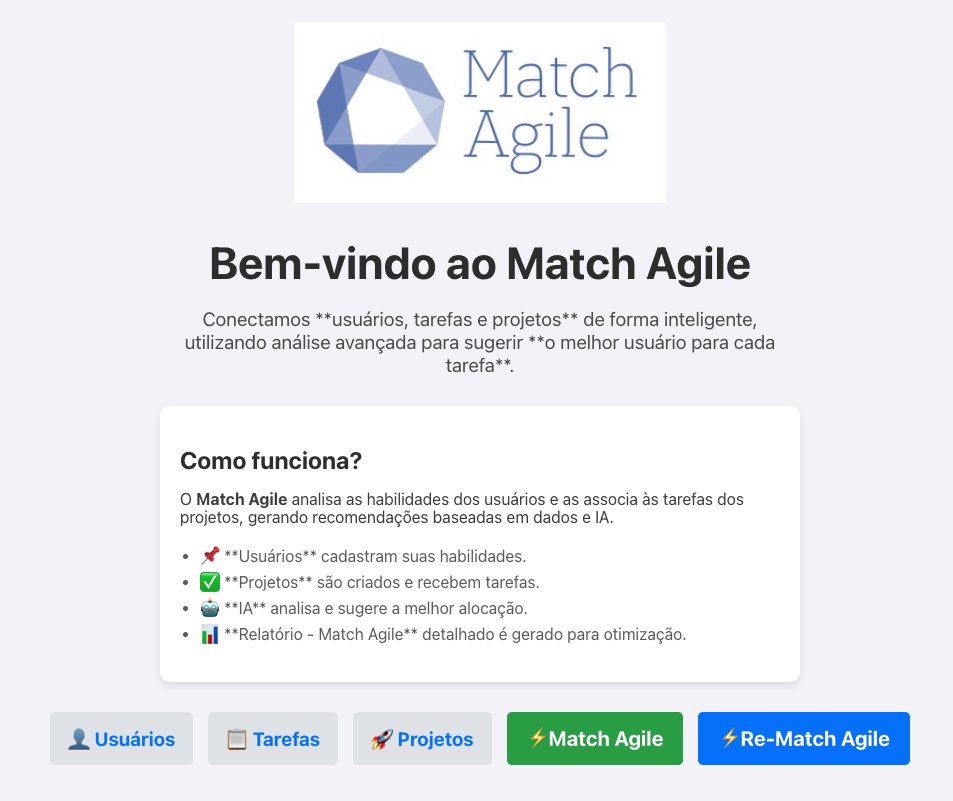

# Match Agile

Bem-vindo ao **Match Agile**, uma aplicação inovadora que conecta usuários, tarefas e projetos de forma inteligente. Utilizando análise avançada, sugerimos o **melhor usuário para cada tarefa**, otimizando a alocação de recursos e gerando recomendações com base em dados e IA.

## Tecnologias

- **Frontend**: React.js (com npm)
- **Backend**: Flask
- **Banco de Dados**: (Adicionar se houver)
- **Containerização**: Docker Compose

## Estrutura do Projeto

Este projeto é composto por duas partes principais: o frontend em **React** e o backend em **Flask**.

### Frontend

O frontend é desenvolvido em **React** e utiliza **npm** como gerenciador de pacotes. Ele contém a interface que permite aos usuários interagir com a aplicação, cadastrar habilidades, visualizar projetos e tarefas, além de acompanhar a alocação sugerida pela IA.

#### Como rodar o frontend:

1. Clone o repositório:
   \`\`\`bash
   git clone https://github.com/seu-usuario/match-agile.git
   cd match-agile/frontend
   \`\`\`

2. Instale as dependências:
   \`\`\`bash
   npm install
   \`\`\`

3. Inicie o servidor de desenvolvimento:
   \`\`\`bash
   npm start
   \`\`\`

### Backend

O backend é desenvolvido em **Flask** e é responsável por lidar com as requisições, processar dados e fornecer as informações necessárias para a IA sugerir a alocação de usuários para as tarefas dos projetos.

#### Como rodar o backend:

1. Clone o repositório:
   \`\`\`bash
   git clone https://github.com/seu-usuario/match-agile.git
   cd match-agile/backend
   \`\`\`

2. Crie e ative um ambiente virtual:
   \`\`\`bash
   python3 -m venv venv
   source venv/bin/activate  # No Windows use \`venv\\Scripts\\activate\`
   \`\`\`

3. Instale as dependências:
   \`\`\`bash
   pip install -r requirements.txt
   \`\`\`

4. Inicie o servidor Flask:
   \`\`\`bash
   python app.py
   \`\`\`

### Docker Compose

Este projeto utiliza **Docker Compose** para facilitar a configuração e execução do backend e do frontend em containers.

#### Como rodar com Docker Compose:

1. Clone o repositório:
   \`\`\`bash
   git clone https://github.com/seu-usuario/match-agile.git
   cd match-agile
   \`\`\`

2. Crie e inicie os containers:
   \`\`\`bash
   docker-compose up --build
   \`\`\`

3. O backend estará disponível em \`http://localhost:5000\` e o frontend em \`http://localhost:3000\`.

## Como funciona?

O **Match Agile** analisa as habilidades dos usuários e as associa às tarefas dos projetos, gerando recomendações baseadas em dados e IA.

### Etapas principais:
- 📌 **Usuários** cadastram suas habilidades.
- ✅ **Projetos** são criados e recebem tarefas.
- 🤖 **IA** analisa e sugere a melhor alocação.
- 📊 **Relatório - Match Agile** detalhado é gerado para otimização.

### Funcionalidades

- Cadastro de **usuários** com suas habilidades.
- Criação e gerenciamento de **projetos** e **tarefas**.
- Geração de **relatórios detalhados** de alocação de tarefas.
- Recomendação inteligente de alocação de tarefas usando IA.

## Estrutura de Pastas

- **frontend/**: Código fonte do frontend em React.
- **backend/**: Código fonte do backend em Flask.
- **docker-compose.yml**: Arquivo de configuração do Docker Compose para rodar a aplicação.

## Contribuição

1. Faça o fork deste repositório.
2. Crie uma branch para sua feature (\`git checkout -b minha-feature\`).
3. Commit suas mudanças (\`git commit -am 'Adiciona nova feature'\`).
4. Push para a branch (\`git push origin minha-feature\`).
5. Abra um pull request.

## Licença

Distribuído sob a licença MIT. Veja o arquivo [LICENSE](LICENSE) para mais detalhes.

## Contato

- Desenvolvedor: [Lucas Araújo](https://github.com/LucasAraujoBR)
- Email: lucaraj1412@gmail.com
